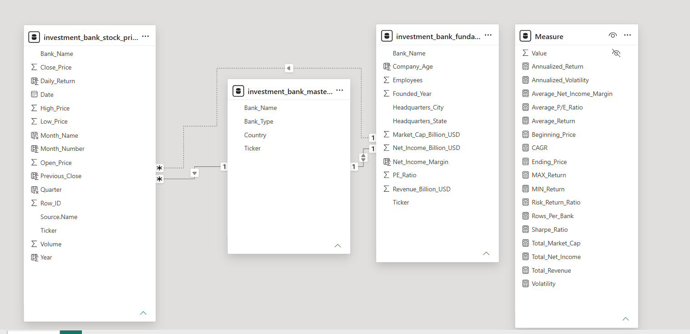
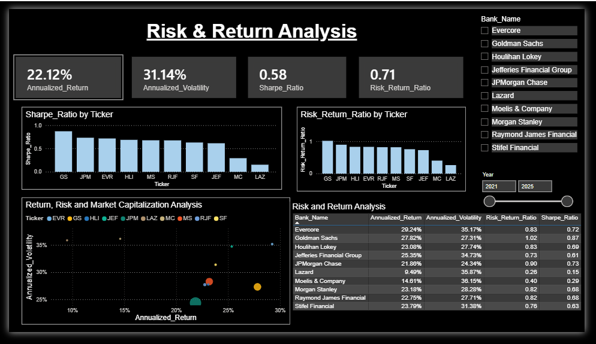
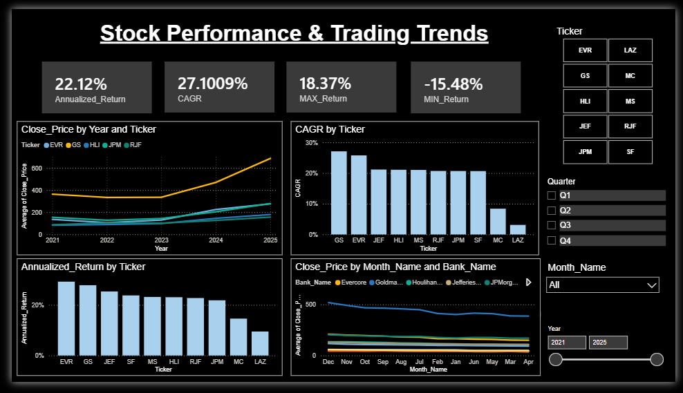
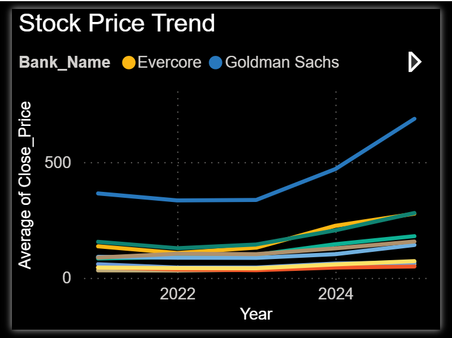
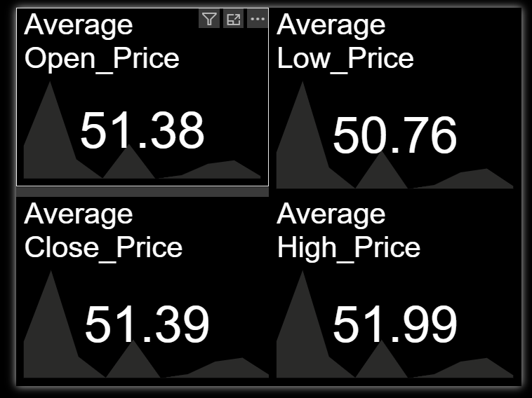
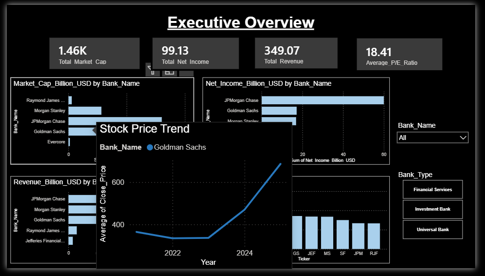
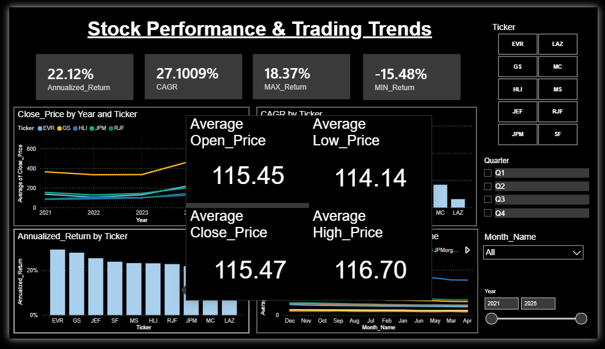

# Global Investment Banking Analytics Dashboard

### Power BI | Financial Analysis | Risk & Return Analytics | Stock Market Performance

---

## Project Overview

This project is an end-to-end Power BI dashboard developed to analyze the financial performance, stock market behavior, and risk-return characteristics of leading global investment banks.

The dashboard combines historical stock price data with company fundamentals to provide insights into profitability, valuation, market performance, and risk-adjusted returns.

The analysis covers a five-year period (2021–2025) and enables users to compare major investment banks through interactive visualizations, KPIs, and advanced financial metrics.

---

## Dashboard Objectives

* Analyze the financial health of investment banks using key fundamental metrics.
* Evaluate stock performance across multiple years.
* Compare risk-adjusted returns using financial ratios.
* Identify high-performing banks based on return and volatility metrics.
* Provide an interactive analytical platform for investment comparison.

---

## Banks Included

* Goldman Sachs (GS)
* JPMorgan Chase (JPM)
* Morgan Stanley (MS)
* Evercore (EVR)
* Lazard (LAZ)
* Houlihan Lokey (HLI)
* Jefferies Financial Group (JEF)
* Raymond James Financial (RJF)
* Moelis & Company (MC)
* Stifel Financial (SF)

---

# Data Model

The dashboard follows a dimensional modeling approach using three primary tables and a dedicated measures table.

## 1. Investment Bank Stock Prices

This table was created by consolidating 10 individual Excel files containing daily stock market data for leading investment banks.

**Records:** 12,550+

**Time Period:** 2021–2025

### Key Fields

Date, Open_Price, High_Price, Low_Price, Close_Price, Volume, Daily_Return, Month_Name, Month_Number, Quarter, Year, Bank_Name, Ticker

---

## 2. Investment Bank Fundamentals

Contains company-level financial and valuation metrics.

### Key Fields

Bank_Name, Ticker, Market_Cap_Billion_USD, Revenue_Billion_USD, Net_Income_Billion_USD, PE_Ratio, Net_Income_Margin, Employees, Founded_Year, Company_Age, Headquarters_City, Headquarters_State

---

## 3. Investment Bank Master Lookup

Dimension table used to standardize bank information and maintain relationships across datasets.

### Key Fields

Bank_Name, Ticker, Bank_Type, Country

---

## 4. Measures Table

Dedicated table containing all DAX calculations used throughout the dashboard.

### Measures Included

* Annualized Return
* Annualized Volatility
* Sharpe Ratio
* Risk Return Ratio
* CAGR
* Total Revenue
* Total Net Income
* Total Market Capitalization
* Average P/E Ratio
* Average Net Income Margin
* Maximum Return
* Minimum Return
* Beginning Price
* Ending Price

---

## Data Model Architecture

The model is designed around a centralized lookup table (**Investment Bank Master Lookup**) which connects stock price data and fundamental company data using Bank_Name and Ticker.

This structure ensures:

* Consistent filtering across report pages
* Efficient DAX calculations
* Reduced data redundancy
* Improved report performance

### Model View



---

# Dashboard Pages

## 1. Executive Overview

Provides a high-level summary of company fundamentals and valuation metrics.

### KPIs

* Total Market Capitalization
* Total Revenue
* Total Net Income
* Average P/E Ratio

### Visuals

* Market Capitalization by Bank
* Revenue by Bank
* Net Income by Bank
* P/E Ratio by Ticker

### Filters

* Bank Name
* Bank Type

### Dashboard Preview


---

## 2. Risk & Return Analysis

Analyzes risk-adjusted performance across investment banks.

### KPIs

* Annualized Return
* Annualized Volatility
* Sharpe Ratio
* Risk Return Ratio

### Visuals

* Sharpe Ratio by Ticker
* Risk Return Ratio by Ticker
* Risk-Return Profile Scatter Plot
* Performance Comparison Table

### Features

* Market Capitalization Bubble Sizing
* Interactive Filtering
* Risk vs Return Comparison

### Dashboard Preview



---

## 3. Stock Performance & Trading Trends

Provides insights into historical stock price movements and long-term growth trends.

### KPIs

* Annualized Return
* CAGR
* Maximum Return
* Minimum Return

### Visuals

* Close Price Trend by Year
* CAGR by Ticker
* Annualized Return by Ticker
* Monthly Closing Price Trend

### Filters

* Ticker
* Quarter
* Month
* Year

### Dashboard Preview



---

# Interactive Features

Custom tooltip pages were created to provide additional insights when interacting with visuals.

## Stock Trend Tooltip



---

## Price Analysis Tooltip



---

## Tooltip Interaction Examples





---

# DAX Measures Implemented

### Return Metrics

* Annualized Return
* Average Return
* CAGR
* Maximum Return
* Minimum Return

### Risk Metrics

* Volatility
* Annualized Volatility
* Sharpe Ratio
* Risk Return Ratio

### Fundamental Metrics

* Total Revenue
* Total Net Income
* Total Market Capitalization
* Average P/E Ratio
* Average Net Income Margin

---

# Project Structure

```text
GLOBAL_INVESTMENT_BANKING_DASHBOARD/
│
├── Dashboard_images/
│   ├── executive_overview.png
│   ├── risk_and_return.png
│   ├── stock_trends.png
│   ├── stock_trend_tooltip.png
│   ├── prices_tooltip.png
│   ├── tooltip_hovering_1.png
│   └── tooltip_hovering_2.png
│
├── dataset/
│
├── global_investment_banking_dashboard.pbix
│
├── model_view.png
│
└── README.md
```

---

## Conclusion

This project demonstrates the development of a comprehensive Power BI analytics solution that combines financial fundamentals, historical stock market data, and risk-return metrics to evaluate the performance of major global investment banks. Through interactive visualizations and advanced DAX calculations, the dashboard enables meaningful comparison of profitability, valuation, growth, and risk-adjusted performance across institutions.
